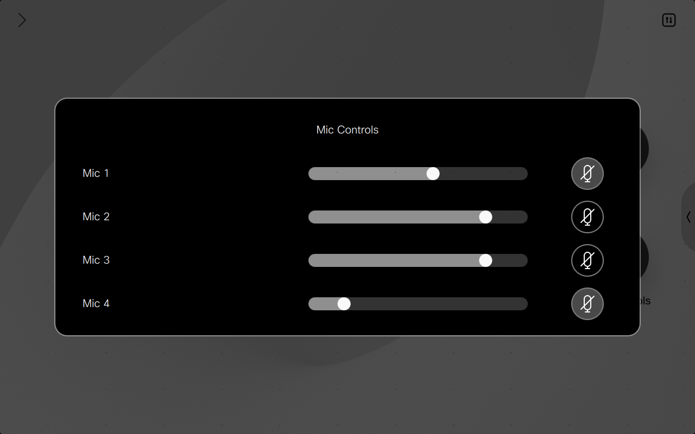

# Mic Controller Macro

This is an example macro for controlling individual mics inputs on Cisco Collab Devices. This enables users to change the gain and toggle the mute for individual microphone inputs availabe on the Deivce.



## Overview

This macro creates a UI Extension panel based on the config you provide. Therefore allowing you to specify which microphones you which to make available to control.

```javascript
const config = {
  button: {
    name: 'Mic Controls',   // Name of the Button and Panel Page
    icon: 'Microphone'      // One of the supported native icons name
  },
  mics: [1, 2, 3, 4],       // Mics which you wish to control
  panelId: 'micController'  // PanelId is used for the base panel and widget Ids
}
```


## Setup

### Prerequisites & Dependencies: 

- RoomOS 11.24.x or above Webex Device.
- Web admin access to the device to upload the macro.


### Installation Steps:
1. Download the ``mic-controller.js`` file and upload it to your Webex Room devices Macro editor via the web interface.
2. Configure the Macro by changing the initial values, there are comments explaining each one.
      ```javascript
      const config = {
          button: {
            name: 'Mic Controls',   // Name of the Button and Panel Page
            icon: 'Microphone'      // One of the supported native icons name
          },
          mics: [1, 2, 3, 4],       // Mics which you wish to control
          panelId: 'micController'  // PanelId is used for the base panel and widget Ids
        }
      ```
3. Enable the Macro on the editor.
    
    
    
## Demo


*For more demos & PoCs like this, check out our [Webex Labs site](https://collabtoolbox.cisco.com/webex-labs).

## License

All contents are licensed under the MIT license. Please see [license](LICENSE) for details.


## Disclaimer

Everything included is for demo and Proof of Concept purposes only. Use of the site is solely at your own risk. This site may contain links to third party content, which we do not warrant, endorse, or assume liability for. These demos are for Cisco Webex use cases, but are not Official Cisco Webex Branded demos.


## Questions
Please contact the WXSD team at [wxsd@external.cisco.com](mailto:wxsd@external.cisco.com?subject=RepoName) for questions. Or, if you're a Cisco internal employee, reach out to us on the Webex App via our bot (globalexpert@webex.bot). In the "Engagement Type" field, choose the "API/SDK Proof of Concept Integration Development" option to make sure you reach our team. 
